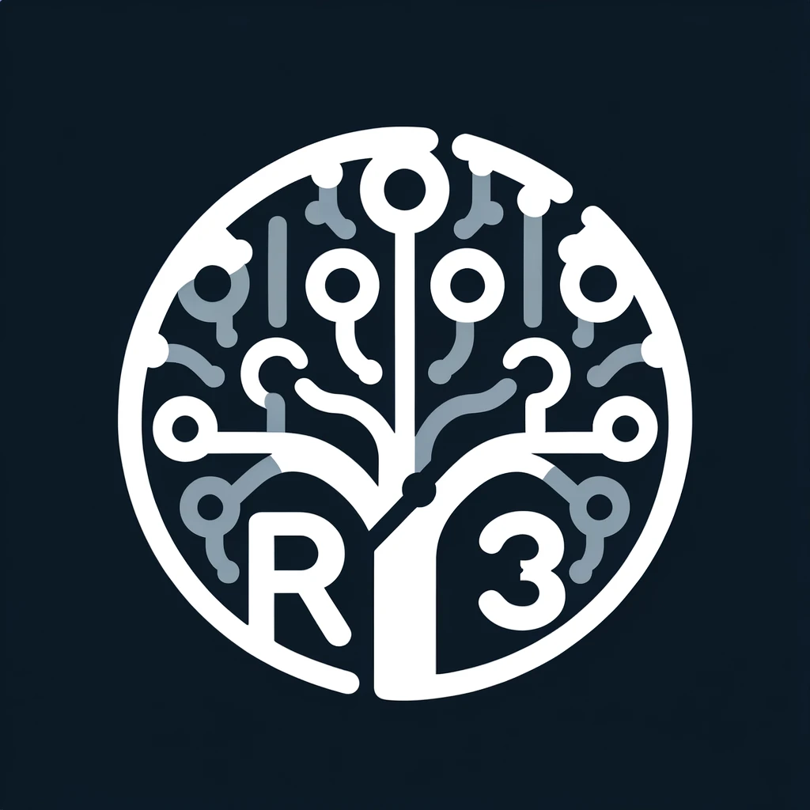

# R3 



**R3**: <ins>R</ins>ESTful Patte<ins>r</ins>n <ins>R</ins>ecognition (R3) for the Apache SkyWalking AI pipeline.


### What is R3?
Modern APIs are often written in a RESTful convention. For example, the below endpoint contains four parameters, meaning each instance of this endpoint will be different although they share the same pattern.

`/api/v{apiVersion}/artists/{artistid}/moments/{postid}/comments/{commentid}`

While the DevOps team could setup rules for grouping such URI patterns, it quickly gets overwhelming when there are numerous endpoints across services. 

R3 is a project that entirely eliminates the need for writing complex expressions to group RESTful endpoints for runtime performance analysis tasks.

**IMPORTANT** The R3 algorithm is based on machine learning and, as with any algorithm, it doesn't guarantee 100% accuracy (still, it's highly accurate). 
However, it offers a powerful and convenient solution for grouping RESTful endpoints in any scenario.

### Getting Started
Currently, R3 offers a simple gRPC service that could be deployed easily at local or containerized environments.

#### Simple Server (Multiprocessing Producer Consumer)

The simple server is the best way to get started, which could steadily serve 500+ SkyWalking services * 3000 uris per minute). 

TODO: Fault tolerence and persistence is not implemented yet.

To run the R3 service on localhost:

```bash
python -m servers.simple.run
```

To deploy as a container:

```
docker run -d --name r3 -p 17128:17128 r3:latest 
```


### Algorithm: URIDrain
If you are curious how the algorithm actually works or decided to improve upon it, please first read the [URIDrain Overview](models/README.md) and checkout the algorithm live demo by running below commands:

To run a demo of the algorithm (implemented with [Gradio](https://gradio.app/)):

1. Install the dependencies with `make install` (or `make env` if you plan to contribute code)
2. Run `python demo.demo_gradio`
3. Open `http://localhost:8080` in your browser or access through remote gradio service from the web by setting `launch(share=True)`
4. Enjoy!


### Licenses
This project is dual-licensed under MIT and Apache 2.0.

The URIDrain algorithm implemented in this project is a modified version of the upstream [Drain3](https://github.com/logpai/Drain3) log clustering algorithm. 

Therefore, the modified algorithm is also licensed under MIT as the upstream. The remaining utilities and services are licensed under Apache 2.0, which also allows commercial usage as long as users adhere to the license terms.

### Contributing
We welcome contributions from the community to make R3 more robust. Whether it's bug fixes, feature enhancements, or new ideas, your input is valuable.